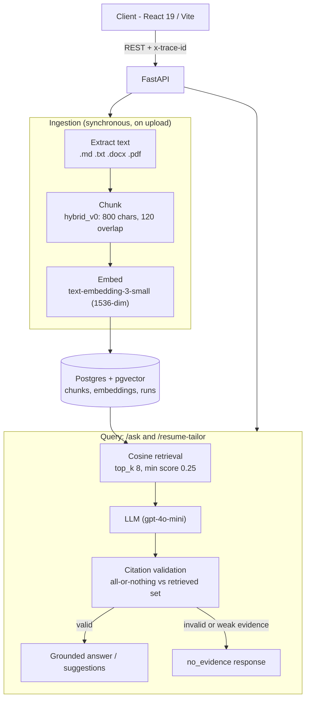
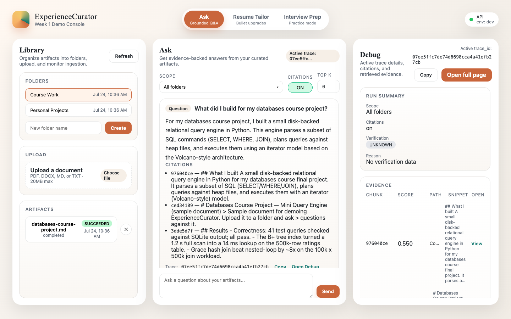
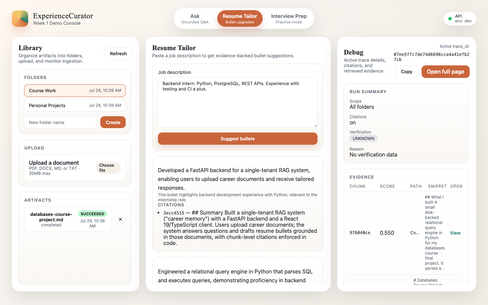
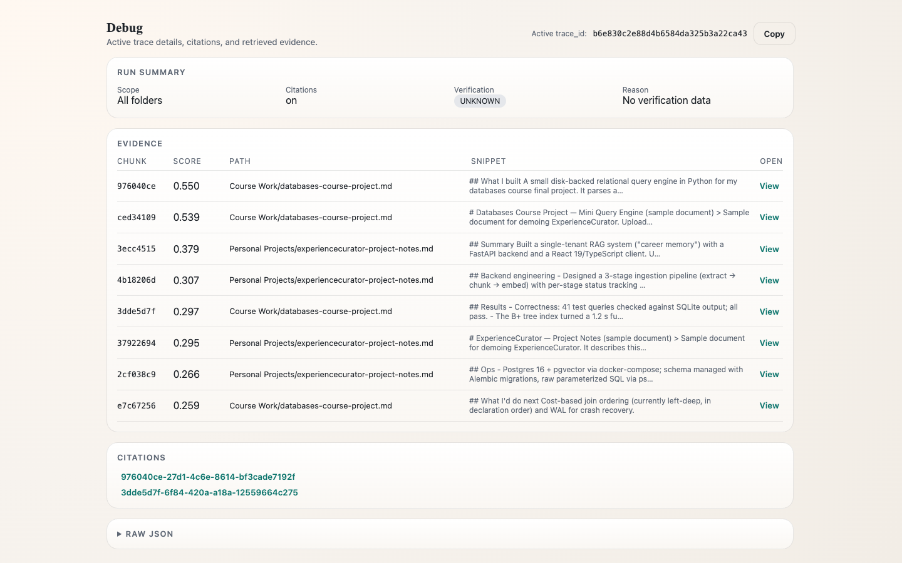

# ExperienceCurator

Single-tenant "career memory" RAG system for CS students. Upload career documents (project notes, coursework, internship writeups), ask questions grounded in them, and generate resume bullet suggestions tailored to a job description. Every answer cites the exact chunks it came from.

The core trust rule is "no evidence, no claim". If retrieval finds nothing relevant, or the model cites a chunk that was not actually retrieved, the system returns a `no_evidence` response instead of inventing one.

## Architecture



Every request carries an `x-trace-id` (honored if supplied, generated otherwise). Query endpoints record each run (question, parameters, retrieved chunks with scores, final citations) into the `runs`, `run_retrieved_chunks`, and `run_citations` tables, so any answer can be inspected after the fact at `/runs/{trace_id}` or in the debug UI.

The citation guarantee is enforced in code, after the LLM responds. Cited chunk ids are validated against the set actually retrieved for that request, and validation is all-or-nothing. If any cited id is not in the retrieved set, the citations are rejected and the request falls back to `no_evidence`; in `/resume-tailor` the rule applies per suggestion, so a suggestion with an unknown or empty citation list is dropped. A returned citation therefore always maps to a real chunk from a real document.

## Features

| Feature | Status | Where |
|---|---|---|
| Folders + document upload (.md/.txt/.docx/.pdf, dedupe, 20 MB cap) | Implemented | `POST /artifacts/upload`, LibraryPane |
| Synchronous 3-stage ingestion (extract → chunk → embed) with per-stage status | Implemented | `server/src/app/ingestion.py` |
| Vector retrieval with folder scoping | Implemented | `POST /retrieve` |
| Grounded Q&A with citations (`on`) and uncited `brainstorm` mode | Implemented | `POST /ask`, AskPane |
| Resume bullet suggestions from a job description, cited per suggestion | Implemented | `POST /resume-tailor`, ResumePane |
| Run tracing + debug UI (retrieved chunks, scores, citations per request) | Implemented | `GET /runs/{trace_id}`, `/debug/:traceId` |
| Chunk viewer (full chunk text + source artifact) | Implemented | `GET /chunks/{chunk_id}` |
| Experience map (aggregate skills view) | Stubbed (returns 501) | `api/experience_map.py` |
| Repo ingestion / repo map | Stubbed (returns 501) | `api/repo_map.py` |
| Interview prep | Planned (disabled UI only) | InterviewPane |

The stubbed endpoints exist as routes so the API surface is visible, but they return `501 Not Implemented` and their UI panes are disabled. See the roadmap below.

## Quickstart

Prerequisites: Docker, Python 3.12 with [uv](https://docs.astral.sh/uv/), Node.js 20+, and an OpenAI API key.

```bash
# 1. Start Postgres (pgvector) on :5432 and pgAdmin on :5050
docker compose -f docker/docker-compose.yml up -d

# 2. Configure the server
cp server/.env.example server/.env
# then edit server/.env and set OPENAI_API_KEY

# 3. Run migrations and start the API on :8000
cd server
uv sync
uv run alembic upgrade head
uv run uvicorn src.app.main:app --reload

# 4. Start the client on :5173 (separate terminal)
cd client
npm install
VITE_API_BASE=http://localhost:8000 npm run dev
```

Open http://localhost:5173/app. The `.env.example` defaults (`DATABASE_URL`, `ALEMBIC_DATABASE_URL`) already match the compose file's credentials (`admin`/`admin_pass`/`app_db`), so only `OPENAI_API_KEY` needs a real value. Migrations create the `vector` extension themselves — no manual `psql` step.

To try it without your own documents, create a folder in the UI and upload the files in [`examples/sample_docs/`](examples/sample_docs) — the API examples and screenshots below were produced from exactly those docs.

Tests are hermetic (no database or API key required):

```bash
cd server && uv run pytest
```

## API examples

### POST /ask

```bash
curl -s http://localhost:8000/ask \
  -H "Content-Type: application/json" \
  -d '{
    "question": "What did I build for my databases course project?",
    "citations_mode": "on",
    "top_k": 8
  }'
```

Response (captured from a live run over the [sample docs](examples/sample_docs); `retrieved` trimmed to 2 of 8 chunks and storage paths shortened for readability):

```json
{
  "trace_id": "b6e830c2e88d4b6584da325b3a22ca43",
  "answer_text": "For my databases course project, I built a small disk-backed relational query engine in Python. This engine is capable of parsing a subset of SQL, including SELECT, WHERE, and JOIN clauses. It plans queries against heap files and executes them using an iterator model based on the Volcano-style approach.",
  "citations": [
    {
      "chunk_id": "976040ce-27d1-4c6e-8614-bf3cade7192f",
      "snippet": "## What I built A small disk-backed relational query engine in Python for my databases course final project. It parses a subset of SQL (SELECT/WHERE/JOIN), plans queries against heap files, and executes them with an iterator (Volcano-style) model.",
      "artifact_path": "server/storage/artifacts/5160160a-e594-4f2b-b14b-fcef8cf4b75e__databases_course_project.md",
      "artifact_filename": "databases-course-project.md",
      "score": 0.549540877342228,
      "locator": { "part": null, "type": "md", "level": 2, "heading": "What I built" }
    },
    {
      "chunk_id": "3dde5d7f-6f84-420a-a18a-12559664c275",
      "snippet": "## Results - Correctness: 41 test queries checked against SQLite output; all pass. - The B+ tree index turned a 1.2 s full scan into a 14 ms lookup on the 500k-row ratings table. - Grace hash join beat nested-loop by ~8x on the 100k x 500k join workload.",
      "artifact_path": "server/storage/artifacts/5160160a-e594-4f2b-b14b-fcef8cf4b75e__databases_course_project.md",
      "artifact_filename": "databases-course-project.md",
      "score": 0.29700002634525613,
      "locator": { "part": null, "type": "md", "level": 2, "heading": "Results" }
    }
  ],
  "retrieved": [
    { "chunk_id": "976040ce-27d1-4c6e-8614-bf3cade7192f", "score": 0.549540877342228, "rank": 1 },
    { "chunk_id": "ced34109-1d47-4d1a-978a-017fb63838e2", "score": 0.5386877609863719, "rank": 2 }
  ],
  "no_evidence": false,
  "warning": null
}
```

`citations_mode: "brainstorm"` skips citation enforcement for open-ended ideation; the response is explicitly marked as uncited. `scope_folder_ids` limits retrieval to specific folders.

### POST /resume-tailor

```bash
curl -s http://localhost:8000/resume-tailor \
  -H "Content-Type: application/json" \
  -d '{
    "job_description": "Backend intern: Python, PostgreSQL, REST APIs. Experience with testing and CI a plus."
  }'
```

Response (captured from a live run over the sample docs; trimmed to 2 of 4 suggestions and 1 of 8 evidence chunks, storage paths shortened):

```json
{
  "trace_id": "39ce92bd7cb44ac5969383c19af7ba57",
  "no_evidence": false,
  "suggestions": [
    {
      "bullet": "Developed a relational query engine in Python that parses SQL and executes queries, enhancing backend data handling capabilities.",
      "rationale": "This bullet highlights Python programming and database interaction, relevant to backend development.",
      "citations": [
        {
          "chunk_id": "976040ce-27d1-4c6e-8614-bf3cade7192f",
          "snippet": "## What I built A small disk-backed relational query engine in Python for my databases course final project. It parses a subset of SQL (SELECT/WHERE/JOIN), plans queries against heap files, and executes them with an iterator (Volcano-style) model.",
          "artifact_path": "server/storage/artifacts/5160160a-e594-4f2b-b14b-fcef8cf4b75e__databases_course_project.md",
          "artifact_filename": "databases-course-project.md",
          "score": 0.39107641444750263,
          "locator": { "part": null, "type": "md", "level": 2, "heading": "What I built" }
        }
      ]
    },
    {
      "bullet": "Implemented a PostgreSQL database schema with Alembic migrations, ensuring efficient data management and version control.",
      "rationale": "This bullet emphasizes experience with PostgreSQL, aligning with the job requirements.",
      "citations": [
        {
          "chunk_id": "2cf038c9-53df-4adb-8e9f-e03ec45e0f9d",
          "snippet": "## Ops - Postgres 16 + pgvector via docker-compose; schema managed with Alembic migrations, raw parameterized SQL via psycopg at request time.",
          "artifact_path": "server/storage/artifacts/1a4587ba-ab2a-49e1-b871-75295a454418__experiencecurator_project_notes.md",
          "artifact_filename": "experiencecurator-project-notes.md",
          "score": 0.42989186343308505,
          "locator": { "part": null, "type": "md", "level": 2, "heading": "Ops" }
        }
      ]
    }
  ],
  "evidence": [
    {
      "chunk_id": "2cf038c9-53df-4adb-8e9f-e03ec45e0f9d",
      "snippet": "## Ops - Postgres 16 + pgvector via docker-compose; schema managed with Alembic migrations, raw parameterized SQL via psycopg at request time.",
      "artifact_path": "server/storage/artifacts/1a4587ba-ab2a-49e1-b871-75295a454418__experiencecurator_project_notes.md",
      "artifact_filename": "experiencecurator-project-notes.md",
      "score": 0.42989186343308505,
      "locator": { "part": null, "type": "md", "level": 2, "heading": "Ops" }
    }
  ],
  "message": null
}
```

Each suggestion carries its own `citations` list resolved against the retrieved evidence; suggestions the model could not support are dropped before the response is returned.

### Inspecting a run

Every response echoes `x-trace-id`. Feed it back to see exactly what the system retrieved and cited:

```bash
curl -s http://localhost:8000/runs/<trace-id>
```

or open `http://localhost:5173/debug/<trace-id>`.

## Screenshots

Grounded Q&A over the sample docs — answer with chunk-level citations, evidence scores in the debug pane:



Resume Tailor — job description in, cited bullet suggestions out:



Run inspection at `/debug/{trace_id}` — every retrieved chunk with its score, and which ones were actually cited:



## How retrieval stays honest

- Citations are chunk-level: each cited id resolves to a stored chunk with its source artifact and locator (page/heading), not to a whole document.
- All-or-nothing validation: any cited chunk id outside the retrieved set invalidates the whole citation set and triggers the `no_evidence` fallback, so hallucinated ids never reach the client.
- Similarity floor: if the top retrieval score is below 0.25 (cosine), the LLM is never called; the API returns `no_evidence: true` with an explicit message.
- `/resume-tailor` validates per suggestion: a bullet with unknown or missing citations is dropped rather than returned uncited. If zero suggestions survive, the response is `no_evidence`.
- Every query run is recorded (parameters, retrieved chunks with scores, final citations) and can be inspected via `GET /runs/{trace_id}` or the `/debug/{traceId}` UI.

## Repository layout

```
client/                  React 19 + TypeScript + Vite (panes UI, debug view)
server/
  src/app/
    api/                 Route modules (ask, retrieval, resume_tailor, artifacts, runs, ...)
    services/            extractor, chunker, embed
    db/                  SQLAlchemy models (Alembic only; requests use raw SQL via psycopg)
  migrations/            Alembic migrations (includes pgvector extension bootstrap)
  tests/                 Hermetic pytest suite (monkeypatched LLM/DB boundaries)
  docs/                  Deeper docs: routes.md, schema_v0.md
docker/                  docker-compose.yml (pgvector Postgres + pgAdmin)
```

See [`server/docs/`](server/docs/) for route-by-route API documentation and the schema reference.

## Roadmap

- Entities/projects layer: a structured "career filesystem" on top of raw documents (V2)
- Experience map (aggregate skills view) and repo ingestion + repo map, replacing today's 501 stubs
- Interview prep mode
- Async ingestion queue and an ANN index (HNSW) once the corpus outgrows synchronous ingest and sequential scan
- Auth and multi-tenancy (currently single-tenant, no auth)

## Tech stack

- Server: Python 3.12, FastAPI, psycopg (raw parameterized SQL at request time), Alembic + SQLAlchemy (migrations only), httpx to the OpenAI REST API, uv
- Retrieval: Postgres 16 + pgvector, `text-embedding-3-small` (1536-dim, L2-normalized), cosine distance
- Client: React 19, TypeScript (strict), Vite 7
- Tests: pytest, hermetic (no network, no database)

License: [MIT](LICENSE)
